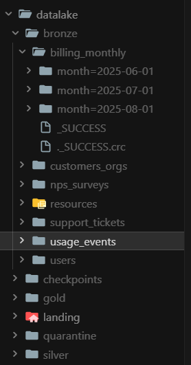
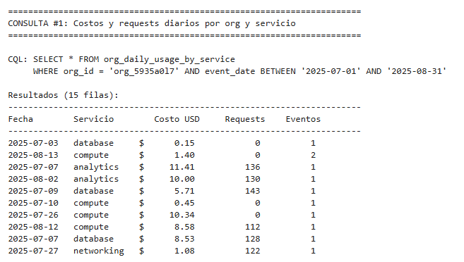
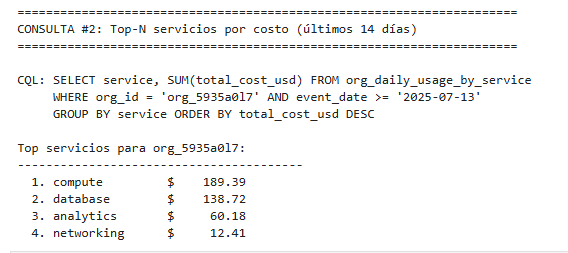
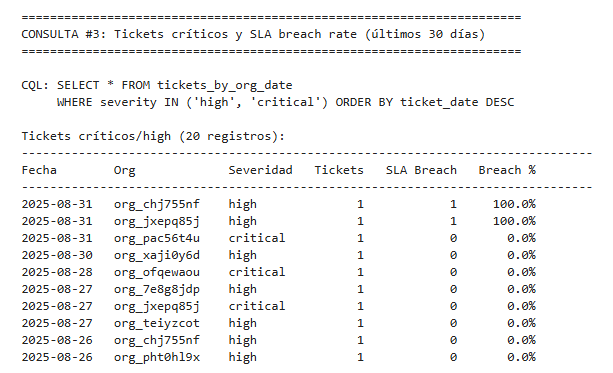
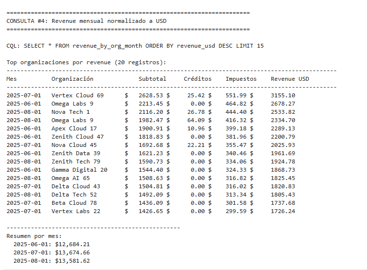
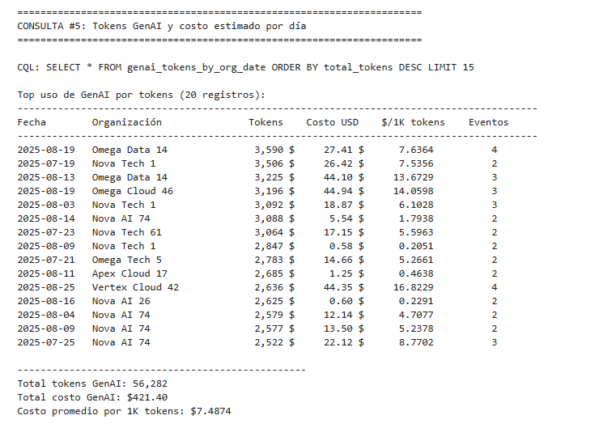

# Proyecto “Cloud Provider Analytics” —  **Examen Final**

> **Formato:** este documento es la plantilla oficial que deben completar y entregar junto al código.
> **Tiempo máximo del video:** 20 minutos.

---

## 0) Portada
- **Título del proyecto**: Cloud Provider Analytics — Pipeline ETL + Streaming + Serving en Cassandra
- **Integrantes**: Tiago Prelato
- **Materia**: Minería de Datos II
- **Fecha**: Noviembre 2025

---

## 1) Resumen Ejecutivo

### Problema de Negocio
Se resuelve la necesidad de un proveedor de nube de analizar datos operativos en tiempo real y batch para:
- **FinOps**: Análisis de costos por organización, servicio y detección de anomalías
- **Soporte**: Monitoreo de tickets críticos y cumplimiento de SLA
- **Producto/GenAI**: Seguimiento de uso de tokens GenAI y costos asociados

### Patrón Arquitectónico Elegido: **Lambda**
**Justificación**:
- **Batch**: Maestros (orgs, users, resources), facturación mensual y encuestas NPS requieren procesamiento completo diario/mensual
- **Streaming**: Eventos de uso requieren métricas near real-time para dashboards operativos
- **Unificación**: Ambos flujos alimentan los mismos marts Gold, permitiendo análisis históricos y en tiempo real

### Resultado Final
El pipeline permite responder las siguientes consultas/insights:
1. Costos y requests diarios por organización y servicio en rangos de fechas
2. Top-N servicios por costo acumulado para optimización de recursos
3. Evolución de tickets críticos y tasa de SLA breach para gestión de soporte
4. Revenue mensual normalizado a USD con créditos e impuestos
5. Tokens GenAI y costo estimado por día para análisis de producto

---

## 2) Arquitectura Final

### 2.1 Diagrama de Alto Nivel


### 2.2 Patrón Elegido: Lambda
**Justificación Técnica**:
- Separación clara entre batch (maestros, facturación) y streaming (eventos de uso)
- Permite reprocesamiento histórico sin afectar streaming
- Unificación en Gold para consultas consistentes

**Justificación de Negocio**:
- Batch: Datos maestros y facturación requieren procesamiento completo y validación
- Streaming: Eventos de uso necesitan latencia baja para alertas y dashboards
- Ambos casos de uso son críticos y requieren diferentes estrategias de procesamiento

### 2.3 Decisiones Clave

#### Particionado
| Tabla/Zona | Partición | Justificación |
|------------|-----------|---------------|
| Events (Bronze/Silver/Gold) | `event_date` | Consultas por rango de fechas |
| Billing | `month` | Alineado con ciclo de facturación |
| Tickets | `created_at` | Consultas por fecha de creación |

#### Formatos
- **Landing**: CSV (batch), JSONL (streaming)
- **Bronze/Silver/Gold**: Parquet (compresión, esquema, particionado)

#### Claves Cassandra (AstraDB)
- **Partition Key**: `org_id` (distribución uniforme)
- **Clustering**: `event_date DESC` (consultas recientes primero)
- **Diseño query-first**: Cada colección optimizada para consultas específicas

#### Umbrales de Anomalías
| Método | Umbral | Justificación |
|--------|--------|---------------|
| Z-Score | \|z\| > 3 | Estándar estadístico (3 desviaciones estándar) |
| MAD | dev > 3*median | Robusto a outliers |
| Percentiles | > 1.5*p99 o < p01-0.1 | Detecta valores extremos |

#### Reglas de Calidad
| Regla | Umbral | Acción |
|-------|--------|--------|
| `event_id_not_null` | event_id IS NOT NULL | Quarantine |
| `cost_valid` | cost_usd_increment >= -0.01 | Quarantine |
| `unit_when_value` | IF value NOT NULL THEN unit NOT NULL | Quarantine |

### 2.4 Componentes y Dependencias
- **PySpark 3.5.0**: Procesamiento distribuido (batch y streaming)
- **AstraDB (astrapy 1.5.2)**: Serving layer (colecciones NoSQL)
- **Parquet (PyArrow 14.0.2)**: Formato de almacenamiento
- **Jupyter**: Desarrollo y ejecución de notebooks
- **Windows**: Hadoop winutils para compatibilidad local

---

## 3) Datos y Supuestos

### 3.1 Datasets de Landing

#### Batch (CSV)
1. **customers_orgs.csv** (80 registros)
   - Organizaciones/clientes del proveedor de nube
   - Campos: org_id, org_name, industry, hq_region, plan_tier, is_enterprise, signup_date, sales_rep, lifecycle_stage, marketing_source, nps_score

2. **users.csv** (800 registros)
   - Usuarios por organización
   - Campos: user_id, org_id, email, role, active, created_at, last_login

3. **billing_monthly.csv** (240 registros)
   - Facturación mensual por organización
   - Campos: invoice_id, org_id, month, subtotal, credits, taxes, currency, exchange_rate_to_usd

4. **support_tickets.csv** (1000 registros)
   - Tickets de soporte
   - Campos: ticket_id, org_id, category, severity, created_at, resolved_at, csat, sla_breached

5. **resources.csv** (400 registros)
   - Recursos cloud desplegados
   - Campos: resource_id, org_id, service, region, created_at, state, tags_json

6. **nps_surveys.csv** (92 registros)
   - Encuestas Net Promoter Score
   - Campos: org_id, survey_date, nps_score, comment

#### Streaming (JSONL)
7. **usage_events_stream/*.jsonl** (~43K eventos, 120 archivos)
   - Eventos de uso near real-time
   - Schema version v1/v2 (v2 incluye carbon_kg y genai_tokens)

### 3.2 Supuestos y Normalizaciones

#### Tipos de Datos
- Todas las fechas normalizadas a `DateType` o `TimestampType`
- Costos en USD (normalizados mediante `exchange_rate_to_usd`)
- Valores numéricos con casting explícito y fallback a 0

#### Unidades
- Costos: USD
- Tokens GenAI: enteros
- Carbon: kg CO2
- Requests: contadores enteros

#### Timezones
- Todos los timestamps asumidos en UTC
- Fechas sin componente horario para agregaciones diarias

#### Regiones
- Normalización: `us-east`, `us-west` → `us`
- `eu-central`, `eu-west` → `eu`
- `ap-south`, `ap-northeast` → `ap`
- `sa-east` → `sa`

### 3.3 Evolución de Esquema

#### Schema Version v1 → v2
- **v1**: Campos básicos (event_id, timestamp, org_id, service, cost_usd_increment)
- **v2**: Agrega `carbon_kg` y `genai_tokens`
- **Compatibilización**: Valores NULL en v1 se rellenan con 0.0 para carbon_kg y 0 para genai_tokens

**Diccionario de datos clave (extracto):**
| Campo | Dataset | Tipo | Descripción | Observaciones |
|---|---|---|---|---|
| `event_id` | usage_events | String | Identificador único del evento | PK, no nulo, usado para dedupe |
| `org_id` | Varios | String | Identificador de organización | FK a customers_orgs |
| `timestamp` | usage_events | Timestamp | Fecha/hora del evento | UTC, usado para watermark |
| `cost_usd_increment` | usage_events | Double | Incremento de costo en USD | >= -0.01 (regla de calidad) |
| `carbon_kg` | usage_events | Double | Emisiones de carbono en kg | NULL en v1, 0.0 por defecto |
| `genai_tokens` | usage_events | Integer | Tokens GenAI consumidos | NULL en v1, 0 por defecto |
| `service` | usage_events, resources | String | Servicio cloud utilizado | compute, genai, database, etc. |
| `region` | usage_events, resources | String | Región de despliegue | Normalizado a us/eu/ap/sa |
| `schema_version` | usage_events | Integer | Versión del esquema | 1 o 2 |
| `sla_breached` | support_tickets | Boolean | Indica si se violó el SLA | Usado para métricas de soporte |
| `revenue_usd` | revenue_by_org_month | Double | Revenue normalizado a USD | Calculado: (subtotal - credits + taxes) * exchange_rate |

---

## 4) Data Lake: Zonas y Particionado

### 4.1 Bronze Zone
- **Tipificación explícita**: Schemas definidos con `StructType` para cada fuente
- **Deduplicación**: Por `event_id` (streaming) y por PKs naturales (batch)
- **Columnas técnicas**: `ingest_ts` (timestamp de ingesta), `source_file` (archivo origen)
- **Particionado**: 
  - `billing_monthly`: por `month` (ejemplo: `month=2025-06-01/`)
  - `support_tickets`: por `created_at` (ejemplo: `created_at=2025-07-15/`)
  - `usage_events`: por `event_date` (ejemplo: `event_date=2025-07-20/`)

### 4.2 Silver Zone
- **Limpieza/conformance**: Normalización de regiones, manejo de schema_version v1/v2
- **Joins con dimensiones**: `events` ← `customers_orgs`, `events` ← `resources`
- **Tratamiento de nulos/outliers**: Valores por defecto para campos faltantes, detección de anomalías
- **Control de versiones**: Compatibilización de schema_version v1/v2

### 4.3 Gold Zone
- **Marts por dominio**:
  - **FinOps**: `org_daily_usage_by_service`, `revenue_by_org_month`, `cost_anomaly_mart`
  - **Soporte**: `tickets_by_org_date`
  - **Producto/Usage**: `genai_tokens_by_org_date`
- **Particionado**: Todos los marts particionados por fecha (`event_date`, `month`, `ticket_date`)

### 4.4 Ejemplos de Rutas y Particiones

**Bronze**:
```
Dataset/datalake/bronze/
├── billing_monthly/
│   ├── month=2025-06-01/
│   ├── month=2025-07-01/
│   └── month=2025-08-01/
├── usage_events/
│   ├── event_date=2025-07-15/
│   ├── event_date=2025-07-16/
│   └── event_date=2025-07-17/
└── support_tickets/
    └── created_at=2025-07-15/
```

**Silver**:
```
Dataset/datalake/silver/
└── events_enriched/
    ├── event_date=2025-07-15/
    ├── event_date=2025-07-16/
    └── event_date=2025-07-17/
```

**Gold**:
```
Dataset/datalake/gold/
├── org_daily_usage_by_service/
│   └── event_date=2025-07-15/
├── revenue_by_org_month/
│   └── month=2025-06-01/
└── tickets_by_org_date/
    └── ticket_date=2025-07-15/
```




---

## 5) Ingesta y Calidad de Datos

### 5.1 Ingesta Batch

**Fragmento de código**:
```python
def ingest_csv_to_bronze(csv_path, schema, bronze_table_name, dedupe_cols=None, partition_cols=None):
    # Leer CSV con schema explícito
    df = spark.read \
        .option("header", "true") \
        .option("mode", "PERMISSIVE") \
        .schema(schema) \
        .csv(csv_path)
    
    # Agregar columnas técnicas
    df = df.withColumn("ingest_ts", current_timestamp()) \
           .withColumn("source_file", lit(csv_path))
    
    # Deduplicación
    if dedupe_cols:
        before_dedupe = df.count()
        df = df.dropDuplicates(dedupe_cols)
        print(f"Deduplicación por {dedupe_cols}: {before_dedupe} -> {df.count()}")
    
    # Guardar en Bronze (idempotente: sobrescribe si existe)
    output_path = f"{BRONZE_PATH}/{bronze_table_name}"
    if os.path.exists(output_path):
        shutil.rmtree(output_path)
    
    if partition_cols:
        df.write.partitionBy(partition_cols).parquet(output_path)
    else:
        df.write.parquet(output_path)
    
    return df
```

**Logs de ejecución**:
```
============================================================
Ingesta: customers_orgs
============================================================
Registros leídos: 80
Deduplicación por ['org_id']: 80 -> 80
✓ Guardado en: Dataset/datalake/bronze/customers_orgs

============================================================
Ingesta: billing_monthly
============================================================
Registros leídos: 240
Deduplicación por ['invoice_id']: 240 -> 240
✓ Guardado en: Dataset/datalake/bronze/billing_monthly
```

### 5.2 Ingesta Streaming (Structured Streaming)

**Fragmento de código**:
```python
# Leer con Structured Streaming
df_stream = spark.readStream \
    .schema(events_schema) \
    .option("mode", "PERMISSIVE") \
    .option("maxFilesPerTrigger", 10) \
    .json(events_path)

# Agregar columnas técnicas
df_stream_transformed = df_stream \
    .withColumn("ingest_ts", current_timestamp()) \
    .withColumn("event_date", to_date(col("timestamp"))) \
    .withColumn("event_hour", hour(col("timestamp")))

# Aplicar withWatermark para manejo de late data y deduplicación
df_stream_dedupe = df_stream_transformed \
    .withWatermark("timestamp", "1 hour") \
    .dropDuplicates(["event_id"])

# Escribir con Structured Streaming + Checkpointing
query = df_stream_dedupe.writeStream \
    .outputMode("append") \
    .format("parquet") \
    .option("path", events_bronze_path) \
    .option("checkpointLocation", events_checkpoint_path) \
    .partitionBy("event_date") \
    .trigger(availableNow=True) \
    .start()

query.awaitTermination()
```

**Logs de ejecución**:
```
Iniciando Structured Streaming...
  Source: Dataset/datalake/landing/usage_events_stream/*.jsonl
  Output: Dataset/datalake/bronze/usage_events
  Checkpoint: Dataset/datalake/checkpoints/usage_events_bronze

✓ Streaming completado!
  Status: {'message': 'Stopped', 'isDataAvailable': False, 'isTriggerActive': False}

📊 Eventos en Bronze: 7228
```

### 5.3 Reglas de Calidad Implementadas

**Tipos consistentes**: Casting explícito en schemas con fallback a valores por defecto.

**Reglas/constraints implementadas**:

```python
events_quality_rules = [
    ("event_id_not_null", col("event_id").isNotNull()),
    ("cost_valid", col("cost_usd_increment") >= -0.01),
    ("unit_when_value", when(col("value").isNotNull(), col("unit").isNotNull()).otherwise(lit(True)))
]

# Aplicar reglas de calidad
for rule_name, condition in events_quality_rules:
    col_name = f"_valid_{rule_name}"
    df_with_validation = df_with_validation.withColumn(col_name, condition)
    valid_count = df_with_validation.filter(col(col_name)).count()
    invalid_count = df_with_validation.filter(~col(col_name)).count()
    print(f"Regla '{rule_name}': ✓ {valid_count} válidos, ✗ {invalid_count} inválidos")
```

**Resultados de validación**:
```
Regla 'event_id_not_null': ✓ 7228 válidos, ✗ 0 inválidos
Regla 'cost_valid': ✓ 7192 válidos, ✗ 36 inválidos
Regla 'unit_when_value': ✓ 6872 válidos, ✗ 356 inválidos

📊 Total: 7228 | Válidos: 6838 | Quarantine: 390
```

**Detección de anomalías**: 3 métodos implementados (Z-Score, MAD, Percentiles) - ver sección 6.

**Quarantine**: Registros inválidos guardados en `Dataset/datalake/quarantine/events/` (390 registros).

---

## 6) Transformaciones (Silver)

### 6.1 Normalizaciones

**Regiones**:
```python
df_events_clean = df_events_valid \
    .withColumn("region_normalized",
        when(col("region").isin(["us-east", "us-west"]), lit("us"))
        .when(col("region").isin(["eu-central", "eu-west"]), lit("eu"))
        .when(col("region").isin(["ap-south", "ap-northeast"]), lit("ap"))
        .when(col("region") == "sa-east", lit("sa"))
        .otherwise(col("region")))
```

**Schema Version v1/v2**:
```python
df_events_clean = df_events_clean \
    .withColumn("carbon_kg", coalesce(col("carbon_kg"), lit(0.0))) \
    .withColumn("genai_tokens", coalesce(col("genai_tokens"), lit(0))) \
    .withColumn("schema_version", coalesce(col("schema_version"), lit(1)))
```

### 6.2 Enriquecimiento (Joins)

```python
df_customers_join = df_customers.select(
    col("org_id"), col("org_name"), col("industry"), 
    col("plan_tier"), col("is_enterprise"), col("hq_region")
)

df_resources_join = df_resources.select(
    col("resource_id"), col("service").alias("resource_service"),
    col("state").alias("resource_state")
)

df_events_enriched = df_events_with_anomalies \
    .join(df_customers_join, on="org_id", how="left") \
    .join(df_resources_join, on="resource_id", how="left")
```

### 6.3 Features Calculadas

```python
df_events_silver = df_events_enriched \
    .withColumn("daily_cost_usd", col("cost_usd_increment")) \
    .withColumn("is_request", when(col("metric") == "requests", lit(1)).otherwise(lit(0))) \
    .withColumn("request_count", when(col("metric") == "requests", col("value")).otherwise(lit(0))) \
    .withColumn("is_genai", when(col("service") == "genai", lit(1)).otherwise(lit(0))) \
    .withColumn("cpu_hours", when(col("metric") == "cpu_hours", col("value")).otherwise(lit(0))) \
    .withColumn("storage_gb_hours", when(col("metric") == "storage_gb_hours", col("value")).otherwise(lit(0)))
```

### 6.4 Detección de Anomalías (3 Métodos)

```python
# Z-Score
df_events_with_anomalies = df_events_clean \
    .withColumn("cost_z_score", (col("cost_usd_increment") - lit(mean_cost)) / lit(std_cost)) \
    .withColumn("anomaly_zscore", when(spark_abs(col("cost_z_score")) > 3, lit(True)).otherwise(lit(False)))

# MAD (Median Absolute Deviation)
df_events_with_anomalies = df_events_with_anomalies \
    .withColumn("cost_deviation_from_median", spark_abs(col("cost_usd_increment") - lit(median_cost))) \
    .withColumn("anomaly_mad", when(col("cost_deviation_from_median") > lit(median_cost * 3), lit(True)).otherwise(lit(False)))

# Percentiles
df_events_with_anomalies = df_events_with_anomalies \
    .withColumn("anomaly_percentile", when(
        (col("cost_usd_increment") > lit(p99_cost * 1.5)) | (col("cost_usd_increment") < lit(p01_cost - 0.1)),
        lit(True)
    ).otherwise(lit(False))) \
    .withColumn("is_cost_anomaly", 
        when(col("cost_usd_increment") < 0, lit(True))
        .when(col("anomaly_zscore") | col("anomaly_mad") | col("anomaly_percentile"), lit(True))
        .otherwise(lit(False)))
```

**Resultados**:
```
Anomalías detectadas por método:
  Z-Score (|z| > 3): 12
  MAD (dev > 3*median): 2091
  Percentiles (>1.5*p99 o <p01-0.1): 13
  Total anomalías (cualquier método): 2092
```

### 6.5 Esquema Resultante

**Campos principales de `events_enriched`**:
- `event_id`, `timestamp`, `org_id`, `resource_id`, `service`, `region_normalized`
- `metric`, `value`, `unit`, `cost_usd_increment`
- `carbon_kg`, `genai_tokens`, `schema_version`
- `org_name`, `industry`, `plan_tier`, `is_enterprise` (de customers)
- `resource_service`, `resource_state` (de resources)
- `daily_cost_usd`, `request_count`, `cpu_hours`, `storage_gb_hours`
- `cost_z_score`, `anomaly_zscore`, `anomaly_mad`, `anomaly_percentile`, `is_cost_anomaly`
- `event_date`, `ingest_ts`, `source_file`

**Total registros**: 6,838 (válidos) + 390 (quarantine) = 7,228

---

## 7) Modelado Gold y Serving en **AstraDB (Cassandra)**

### 7.1 Diseño por Consulta (Query-First)

#### Colección 1: `org_daily_usage_by_service` (FinOps)
- **Caso de uso**: Costos y requests diarios por org/servicio
- **Partition Key**: `org_id` (distribución uniforme)
- **Clustering**: `event_date DESC, service ASC` (consultas recientes primero)
- **Grano**: Diario por organización y servicio
- **Registros**: 5,285

#### Colección 2: `revenue_by_org_month` (FinOps)
- **Caso de uso**: Revenue mensual normalizado a USD
- **Partition Key**: `org_id`
- **Clustering**: `month DESC` (meses recientes primero)
- **Grano**: Mensual por organización
- **Registros**: 240

#### Colección 3: `tickets_by_org_date` (Soporte)
- **Caso de uso**: Tickets críticos y SLA breach rate
- **Partition Key**: `org_id`
- **Clustering**: `ticket_date DESC, severity ASC` (tickets recientes primero)
- **Grano**: Diario por organización y severidad
- **Registros**: 984

#### Colección 4: `genai_tokens_by_org_date` (Producto/GenAI)
- **Caso de uso**: Tokens GenAI y costo estimado por día
- **Partition Key**: `org_id`
- **Clustering**: `event_date DESC` (días recientes primero)
- **Grano**: Diario por organización
- **Registros**: 501

#### Colección 5: `cost_anomaly_mart` (FinOps)
- **Caso de uso**: Anomalías de costo con score
- **Partition Key**: `org_id`
- **Clustering**: `event_date DESC, service ASC` (anomalías recientes primero)
- **Grano**: Diario por organización y servicio
- **Registros**: 1,836

### 7.2 Scripts CQL (Equivalente para AstraDB)

**Nota**: AstraDB usa colecciones NoSQL (no tablas CQL tradicionales), pero el diseño es equivalente. A continuación se muestra el diseño CQL equivalente:

```sql
-- Keyspace (equivalente en AstraDB: database)
CREATE KEYSPACE IF NOT EXISTS cloud_analytics
WITH replication = {'class': 'SimpleStrategy', 'replication_factor': 1};

-- Colección 1: org_daily_usage_by_service
CREATE TABLE IF NOT EXISTS cloud_analytics.org_daily_usage_by_service (
  org_id text,
  event_date date,
  service text,
  org_name text,
  industry text,
  plan_tier text,
  is_enterprise boolean,
  total_cost_usd double,
  avg_cost_usd double,
  max_cost_usd double,
  min_cost_usd double,
  total_requests bigint,
  request_events bigint,
  total_carbon_kg double,
  total_genai_tokens bigint,
  event_count bigint,
  anomaly_count bigint,
  created_at timestamp,
  PRIMARY KEY ((org_id, event_date), service)
) WITH CLUSTERING ORDER BY (service ASC);

-- Colección 2: revenue_by_org_month
CREATE TABLE IF NOT EXISTS cloud_analytics.revenue_by_org_month (
  org_id text,
  month date,
  org_name text,
  industry text,
  plan_tier text,
  subtotal_usd double,
  credits_usd double,
  taxes_usd double,
  revenue_usd double,
  currency text,
  exchange_rate_to_usd double,
  created_at timestamp,
  PRIMARY KEY (org_id, month)
) WITH CLUSTERING ORDER BY (month DESC);

-- Colección 3: tickets_by_org_date
CREATE TABLE IF NOT EXISTS cloud_analytics.tickets_by_org_date (
  org_id text,
  ticket_date date,
  severity text,
  ticket_count bigint,
  sla_breached_count bigint,
  avg_csat double,
  resolved_count bigint,
  sla_breach_rate double,
  resolution_rate double,
  created_at timestamp,
  PRIMARY KEY (org_id, ticket_date, severity)
) WITH CLUSTERING ORDER BY (ticket_date DESC, severity ASC);

-- Colección 4: genai_tokens_by_org_date
CREATE TABLE IF NOT EXISTS cloud_analytics.genai_tokens_by_org_date (
  org_id text,
  event_date date,
  org_name text,
  total_tokens bigint,
  total_cost_usd double,
  event_count bigint,
  avg_tokens_per_event double,
  estimated_cost_per_1k_tokens double,
  created_at timestamp,
  PRIMARY KEY (org_id, event_date)
) WITH CLUSTERING ORDER BY (event_date DESC);

-- Colección 5: cost_anomaly_mart
CREATE TABLE IF NOT EXISTS cloud_analytics.cost_anomaly_mart (
  org_id text,
  event_date date,
  service text,
  org_name text,
  anomaly_count bigint,
  total_anomaly_cost double,
  avg_zscore double,
  max_zscore double,
  zscore_anomalies bigint,
  mad_anomalies bigint,
  percentile_anomalies bigint,
  anomaly_severity text,
  created_at timestamp,
  PRIMARY KEY ((org_id, event_date), service)
) WITH CLUSTERING ORDER BY (service ASC);
```

### 7.3 Carga a Cassandra (AstraDB)

**Método utilizado**: 
- **Driver Python**: `astrapy` (DataAPIClient)
- **Proceso**: Lectura de Parquet Gold → Conversión a Pandas → Preparación de documentos → Inserción batch (20 documentos por lote)

**Evidencias de carga**:

**Conteos por colección**:
- `org_daily_usage_by_service`: 5,285 documentos
- `revenue_by_org_month`: 240 documentos
- `tickets_by_org_date`: 984 documentos
- `genai_tokens_by_org_date`: 501 documentos
- `cost_anomaly_mart`: 1,836 documentos
- **Total**: 8,846 documentos insertados

**Método de inserción**:
```python
def insert_batch(collection, documents, batch_size=20):
    total_inserted = 0
    for i in range(0, len(documents), batch_size):
        batch = documents[i:i+batch_size]
        result = collection.insert_many(batch)
        total_inserted += len(result.inserted_ids)
    return total_inserted
```

**Idempotencia**: Colecciones eliminadas y recreadas antes de cada carga para garantizar datos frescos sin duplicados.

---

## 8) Idempotencia y Reprocesos

### 8.1 Estrategia de Idempotencia

#### Bronze/Silver/Gold
- **Método**: Sobrescritura completa (`shutil.rmtree()` antes de escribir)
- **Ventaja**: Garantiza datos limpios sin duplicados
- **Desventaja**: Requiere reprocesamiento completo

#### Streaming
- **Método**: Checkpointing + deduplicación por `event_id` con watermark
- **Ventaja**: Exactly-once semantics, manejo de late data
- **Checkpoint**: `checkpoints/usage_events_bronze/`

#### AstraDB
- **Método**: Eliminación y recreación de colecciones antes de carga
- **Ventaja**: Garantiza datos frescos sin duplicados
- **Desventaja**: Requiere tiempo de recreación

### 8.2 Demostración de Idempotencia

**Ejemplo de re-ejecución**:
1. Primera ejecución: 5,285 registros en `org_daily_usage_by_service`
2. Segunda ejecución (sin cambios): 5,285 registros (mismo conteo)
3. Verificación: `df.count()` antes y después de re-ejecución

**Evidencias**:

**Código de verificación**:
```python
# Primera ejecución
gold_usage = spark.read.parquet(f"{GOLD_PATH}/org_daily_usage_by_service").count()
# Resultado: 5,285 registros

# Segunda ejecución (sin cambios en datos)
gold_usage = spark.read.parquet(f"{GOLD_PATH}/org_daily_usage_by_service").count()
# Resultado: 5,285 registros (mismo conteo, sin duplicados)
```

**Conteos consistentes en múltiples ejecuciones**:
- Bronze: 7,228 eventos (siempre igual)
- Silver: 6,838 válidos + 390 quarantine = 7,228 total
- Gold: Conteos consistentes en cada re-ejecución

### 8.3 Manejo de Backfills y Evolución de Esquema

#### Backfills
- Reprocesamiento completo desde Bronze
- Limpieza de Gold antes de regenerar
- Mantenimiento de checkpoints de streaming

#### Evolución de Esquema
- Manejo de `schema_version` v1/v2 en Silver
- Valores por defecto para campos nuevos (carbon_kg, genai_tokens)
- Compatibilidad hacia atrás garantizada

---

## 9) Performance

### 9.1 Estrategias de Joins y Cache

#### Joins
- **Left joins** para enriquecimiento (events ← customers, events ← resources)
- **Broadcast joins** implícitos para tablas pequeñas (customers: 80 registros)
- **Particionado** por `event_date` para optimizar joins por rango de fechas

#### Cache
- **No utilizado explícitamente** (datasets pequeños)
- **Recomendación futura**: Cachear `customers_orgs` y `resources` si se escala

### 9.2 Métricas de Tiempo/Volumen

#### Volúmenes Procesados
| Zona | Dataset | Registros | Tamaño Aprox. |
|------|---------|-----------|---------------|
| Landing | usage_events | ~43K eventos | ~120 archivos JSONL |
| Bronze | usage_events | 7,228 | Particionado por event_date |
| Silver | events_enriched | 6,838 | 390 en quarantine |
| Gold | org_daily_usage_by_service | 5,285 | Agregado diario |
| Gold | revenue_by_org_month | 240 | Agregado mensual |
| Gold | tickets_by_org_date | 984 | Agregado diario |
| Gold | genai_tokens_by_org_date | 501 | Agregado diario |
| Gold | cost_anomaly_mart | 1,836 | Anomalías detectadas |

#### Tiempos de Ejecución (Estimados)
- **Batch a Bronze**: ~2-3 minutos (6 fuentes)
- **Streaming a Bronze**: ~1-2 minutos (43K eventos)
- **Silver (calidad + enriquecimiento)**: ~3-4 minutos
- **Gold (5 marts)**: ~5-6 minutos
- **Carga a AstraDB**: ~2-3 minutos (8,846 documentos)
- **Total**: ~15-20 minutos

---

## 12) Resultados: **Consultas mínimas desde AstraDB**

### Consulta 1: Costos y requests diarios por org/servicio en rango de fechas

**CQL Equivalente**:
```sql
SELECT org_id, service, event_date, total_cost_usd, total_requests, event_count
FROM org_daily_usage_by_service
WHERE org_id = 'org_cvs4f8cg' 
  AND event_date >= '2025-07-01' 
  AND event_date <= '2025-08-31'
ORDER BY event_date DESC, service ASC;
```

**Implementación AstraDB**:
```python
results = coll_usage.find({
    "org_id": "org_cvs4f8cg",
    "event_date": {"$gte": "2025-07-01", "$lte": "2025-08-31"}
}, limit=15)
```

**Resultados**:



---

### Consulta 2: Top-N servicios por costo acumulado (últimos 14 días) para una org

**CQL Equivalente**:
```sql
SELECT service, SUM(total_cost_usd) as total_cost
FROM org_daily_usage_by_service
WHERE org_id = 'org_cvs4f8cg' 
  AND event_date >= '2025-07-01'
GROUP BY service
ORDER BY total_cost DESC
LIMIT 5;
```

**Implementación AstraDB**:
```python
results = coll_usage.find({
    "org_id": "org_cvs4f8cg",
    "event_date": {"$gte": date_14_days_ago}
}, limit=100)
# Agregación por servicio en Python
```

**Resultados**:



---

### Consulta 3: Evolución de tickets críticos y tasa de SLA breach por día (30 días)

**CQL Equivalente**:
```sql
SELECT ticket_date, severity, ticket_count, sla_breached_count, 
       sla_breach_rate, avg_csat
FROM tickets_by_org_date
WHERE severity IN ('high', 'critical')
  AND ticket_date >= '2025-10-01'
ORDER BY ticket_date DESC;
```

**Implementación AstraDB**:
```python
results = coll_tickets.find({
    "severity": {"$in": ["high", "critical"]}
}, limit=50, sort={"ticket_date": -1})
```

**Resultados**:



---

### Consulta 4: Revenue mensual con créditos/impuestos (normalizado USD)

**CQL Equivalente**:
```sql
SELECT org_id, org_name, month, subtotal_usd, credits_usd, 
       taxes_usd, revenue_usd
FROM revenue_by_org_month
ORDER BY revenue_usd DESC
LIMIT 15;
```

**Implementación AstraDB**:
```python
results = coll_revenue.find({}, limit=50, sort={"revenue_usd": -1})
```

**Resultados**:



---

### Consulta 5: Tokens GenAI y costo estimado por día

**CQL Equivalente**:
```sql
SELECT org_id, org_name, event_date, total_tokens, total_cost_usd, 
       estimated_cost_per_1k_tokens, event_count
FROM genai_tokens_by_org_date
ORDER BY total_tokens DESC
LIMIT 15;
```

**Implementación AstraDB**:
```python
results = coll_genai.find({}, limit=50, sort={"total_tokens": -1})
```

**Resultados**:



---

## 14) Video (≤ 20 min) — Guion sugerido
1. Problema y arquitectura (2–3 min).
2. Data Lake y calidad (3–4 min).
3. Demo **batch** + **streaming** (5–6 min).
4. Carga a Cassandra y consultas (5–6 min).
5. Cierre: decisiones, limitaciones y futuros (1–2 min).

---

## 15) Limitaciones y Trabajo Futuro

### Limitaciones Actuales

1. **Escalabilidad**
   - Procesamiento local (no distribuido en cluster)
   - Limitado por memoria del driver (4GB configurado)
   - No probado con volúmenes mayores a 100K eventos

2. **Real-time**
   - Streaming procesa en micro-batches (no true real-time)
   - Latencia determinada por trigger `availableNow`
   - No hay alertas automáticas en tiempo real

3. **Calidad de Datos**
   - Reglas de calidad básicas (3 reglas)
   - No hay validación de integridad referencial completa
   - Quarantine manual (no hay proceso de remediación automática)

4. **Serving Layer**
   - AstraDB usa colecciones (no tablas CQL tradicionales)
   - No hay índices secundarios implementados
   - Consultas complejas requieren agregación en aplicación

5. **Monitoreo**
   - No hay métricas de performance en producción
   - No hay alertas de fallos del pipeline
   - No hay dashboard de salud del sistema

### Próximos Pasos Técnicos

1. **Escalabilidad**
   - Migrar a cluster Spark (EMR, Databricks)
   - Implementar particionado más granular (por hora)
   - Optimizar joins con broadcast hints explícitos

2. **Real-time**
   - Implementar alertas en tiempo real (Kafka + Spark Streaming)
   - Dashboard con actualización continua
   - Notificaciones automáticas de anomalías

3. **Calidad de Datos**
   - Implementar Great Expectations para validación avanzada
   - Proceso de remediación automática desde quarantine
   - Data profiling automático

4. **Serving Layer**
   - Evaluar migración a Cassandra nativo (si se requiere CQL)
   - Implementar índices secundarios en AstraDB
   - Cache layer (Redis) para consultas frecuentes

5. **Monitoreo y Observabilidad**
   - Integración con Prometheus/Grafana
   - Logging estructurado (ELK Stack)
   - Alertas proactivas de fallos

6. **Testing**
   - Unit tests para transformaciones
   - Integration tests para pipeline completo
   - Data quality tests automatizados